# AI IDE 自动化工具（V5.1）

Windows 上的轻量自动化助手：基于 PySide6 与 Windows Graphics Capture（windows-capture）实现高性能屏幕/窗口捕获、模板匹配与一键点击，内置托盘应用、GUI 响应性管理、智能窗口定位与自动恢复机制。

—— Windows | PySide6 | OpenCV | WGC | 多线程/多进程

## 目录

- 项目亮点
- 系统要求
- 快速开始
- 运行与托盘操作
- 项目结构
- 配置说明（config.json）
- 工作原理（架构图）
- 测试与质量
- 常见问题与故障排除
- 贡献与许可证
- 更新日志

## 项目亮点

- 高性能捕获与识别：Windows Graphics Capture + OpenCV 模板匹配，支持灰度与多尺度匹配。
- 多线程/多进程架构：IO 任务走 QThreadPool，CPU 密集走 multiprocessing，避免阻塞 GUI。
- 托盘驱动的轻 UI：应用以托盘常驻，右键菜单一键开始/停止扫描与打开设置。
- 智能窗口定位：按进程/标题/类名等多策略匹配，支持自动更新 HWND 与模糊匹配。
- 高 DPI 全面适配：内置 DPI 管理与策略配置，跨屏一致坐标与显示效果。
- GUI 响应性守护：实时监控与告警，自动节流 UI 更新，必要时触发紧急恢复。
- 配置即代码：完整 JSON 配置项覆盖捕获、识别、窗口与性能优化，开箱即用。
- 测试齐全：tests/ 下提供丰富单元/集成/性能冒烟用例，零交互可执行。

## 系统要求

- 操作系统：Windows 10/11（建议 21H2+）
- Python：3.12（默认使用 conda 环境 ）
- 显示器：支持多显示器与不同 DPI 比例

## 快速开始

方式 A（推荐，conda）：

```bat
conda env create -f environment.yml -n use
conda activate use
python -m pip install -r requirements.txt
```

方式 B（pip，已就绪 Python 3.12）：

```bat
python -m pip install -r requirements.txt
```

按项目规范，亦可直接使用固定解释器路径运行（Windows）：

```bat
D:/conda_env/envs/use/python.exe -m pip install -r requirements.txt
```

## 运行与托盘操作

启动应用（推荐在已激活的 `use` 环境中）：

```bat
python main_auto_approve_refactored.py
```

或使用固定解释器路径：

```bat
D:/conda_env/envs/use/python.exe main_auto_approve_refactored.py
```

运行后应用最小化到系统托盘：

- 右键托盘图标 → 开始扫描/停止扫描
- 右键托盘图标 → 设置…（选择模板、调整阈值/ROI/捕获后端等）
- 可选启用：启动后自动开始扫描、按进程名自动更新 HWND

日志默认输出到根目录 `log.txt`（可在设置中开启/关闭）。

## 项目结构

```
AI_IDE_Auto_Run_github_main_V5.1/
├── main_auto_approve_refactored.py     # 主入口，托盘应用 + 多线程/多进程编排
├── config.json                          # 运行时配置（可由 UI 修改并异步保存）
├── requirements.txt                     # pip 依赖
├── environment.yml                      # conda 环境（推荐）
├── auto_approve/                        # 应用层逻辑（配置/托盘/UI/性能/窗口管理）
│   ├── config_manager.py                # 配置加载/迁移/异步保存
│   ├── gui_responsiveness_manager.py    # GUI 响应性与调度
│   ├── performance_*                    # 性能监控与优化
│   ├── auto_hwnd_updater.py             # 自动 HWND 更新器
│   ├── qt_dpi_manager.py                # 高 DPI 策略
│   ├── scanner_worker_refactored.py     # 扫描工作进程桥接
│   └── ...
├── capture/                             # 捕获与图像处理（WGC 后端等）
│   ├── wgc_backend.py
│   ├── shared_frame_cache.py
│   ├── high_performance_frame_buffer.py
│   └── ...
├── workers/                             # 线程池/进程池/异步任务
│   ├── io_tasks.py
│   ├── cpu_tasks.py
│   ├── async_tasks.py
│   └── scanner_process.py
├── utils/                               # 工具与平台适配
│   ├── win_dpi.py
│   ├── performance_profiler.py
│   └── ...
├── assets/
│   ├── icons/
│   ├── images/                          # 模板图片
│   └── styles/                          # QSS 主题
└── tests/                               # 单元/集成/性能冒烟测试（unittest）
```

## 配置说明（config.json）

以下为按功能分组的关键项（默认值以 `auto_approve/config_manager.py` 为准；首次运行会自动生成同名文件并写入默认配置）：

- 基础与识别

  - `template_paths`/`template_path`：多模板/单模板路径
  - `interval_ms`：扫描间隔（毫秒），默认 800
  - `threshold`：匹配阈值 [0,1]，默认 0.88
  - `min_detections`：连续命中帧阈值，默认 1
  - `grayscale`：灰度匹配，默认 true
  - `multi_scale` + `scales`：多尺度匹配开关与比例
  - `click_method` + `click_offset`：点击实现与偏移
- 窗口与多屏

  - `monitor_index`：监视器索引（1 起）
  - `roi`：`{x,y,w,h}`，w/h=0 表示整屏
  - `enable_multi_screen_polling`：多屏轮询与 `screen_polling_interval_ms`
  - `verify_window_before_click`：点击前校验窗口位置
  - `coordinate_transform_mode`/`coordinate_offset`：多屏坐标统一
- 捕获与 WGC

  - `capture_backend`：`window`（窗口）/`monitor`（显示器）
  - `use_monitor`：向后兼容布尔开关
  - `target_hwnd`/`target_process`/`process_partial_match`
  - `fps_max`/`capture_timeout_ms`
  - `include_cursor`、`window_border_required`、`screen_border_required`
- 智能化与自动恢复

  - `enable_smart_finder` + `smart_finder_*`
  - `enable_auto_recovery`、`max_recovery_attempts`、`recovery_cooldown`
  - `finder_strategies`：进程名/路径/标题/类名/模糊匹配
- 行为与调试

  - `auto_start_scan`：启动后自动开始扫描
  - `auto_update_hwnd_by_process` + `auto_update_hwnd_interval_ms`
  - `enable_logging`、`enable_notifications`
  - `debug_mode`、`save_debug_images`、`debug_image_dir`

提示：`config.json` 可通过设置界面更新；内部采用异步保存，避免阻塞 GUI。

## 工作原理（架构图）

```mermaid
flowchart TD
    subgraph UI层
        TrayApp["系统托盘应用<br/>[RefactoredTrayApp](cci:2://file:///d:/Person_project/AI_IDE_Auto_Run_github_main_V5.2/main_auto_approve_refactored.py:118:0-1142:34)"]
        Settings["设置对话框<br/>`SettingsDialog`"]
        Tooltip["托盘菜单与提示<br/>[PersistentTrayMenu](cci:2://file:///d:/Person_project/AI_IDE_Auto_Run_github_main_V5.2/main_auto_approve_refactored.py:104:0-115:36)"]
    end

    subgraph 配置与日志
        Config["配置管理<br/>`load_config` / `save_config`"]
        AppState["应用状态中心<br/>`get_app_state()`"]
        Logger["日志系统<br/>`enable_file_logging`"]
    end

    subgraph 多线程/异步基础设施
        IOExecutor["IO线程池<br/>`workers.io_tasks`"]
        CPUExecutor["CPU进程池<br/>`workers.cpu_tasks`"]
        AsyncLoop["可选qasync事件循环<br/>`workers.async_tasks`"]
    end

    subgraph 扫描后端
        ScannerAdapter["扫描器适配器<br/>[ProcessScannerWorker](cci:2://file:///d:/Person_project/AI_IDE_Auto_Run_github_main_V5.2/auto_approve/scanner_process_adapter.py:169:0-184:16) / `ThreadScannerAdapter`"]
        ScannerManager["扫描进程管理器<br/>`workers.scanner_process`"]
        CaptureMgr["WGC捕获管理器<br/>`CaptureManager`"]
        TemplateMatcher["模板匹配与命中逻辑<br/>OpenCV/NumPy"]
    end

    subgraph 外部目标
        TargetApp["目标窗口/屏幕"]
        WGC["Windows Graphics Capture"]
    end

    TrayApp --> Config
    TrayApp --> AppState
    TrayApp --> Logger
    TrayApp --> IOExecutor
    TrayApp --> CPUExecutor
    TrayApp --> AsyncLoop
    TrayApp --> Settings
    TrayApp --> Tooltip

    TrayApp --> ScannerAdapter
    ScannerAdapter --> ScannerManager
    ScannerManager --> CaptureMgr
    CaptureMgr --> WGC
    CaptureMgr --> TargetApp

    ScannerManager --> TemplateMatcher
    TemplateMatcher --> ScannerManager
    ScannerManager --> TrayApp

    IOExecutor --> TrayApp
    CPUExecutor --> TrayApp
    AsyncLoop --> TrayApp
    AppState --> TrayApp
    Config --> TrayApp
```



## 测试与质量

- 运行全部用例（零交互）：

```bat
python -m unittest discover -s tests -v
```

或使用固定解释器：

```bat
D:/conda_env/envs/use/python.exe -m unittest discover -s tests -v
```

- 典型冒烟：`tests/test_env_smoke.py` 验证依赖与核心模块可导入；其余测试覆盖 DPI、WGC、性能与 UI 响应性等。

- 单文件防卡运行（推荐）：使用带超时的运行器避免个别测试阻塞。

```bat
python tools/run_tests_timeout.py tests/test_ui_performance.py --max-seconds 20
python tools/run_tests_timeout.py -p "tests/test_*ui*.py" -t 15
```

说明：
- 默认开启 `TEST_MODE=1` 并加载仓库根 `sitecustomize.py`，自动裁剪 `QTimer` 延时与 `sleep`，进一步降低卡住风险；
- 任何失败或超时将以非0退出码返回，并打印精简摘要与 3–5 条修复建议；
- 需要更激进的裁剪，可通过环境变量调整：`AIIDE_TEST_MAX_DELAY_MS`、`AIIDE_TEST_MAX_INTERVAL_MS`、`AIIDE_TEST_MAX_SLEEP_S`。

## 常见问题与故障排除

- 无法导入 `windows-capture`：请在 Windows 上安装并确保 Python 版本匹配，优先使用 `environment.yml` 创建环境。
- 启动提示 Qt DPI 警告：已由 `qt_dpi_manager` 在应用创建前设置取整策略；如仍异常，可删除用户自定义的相关环境变量重试。
- 无法命中模板：
  - 提高 `threshold` 前先确保模板与目标像素一致（避免缩放/主题差异）；
  - 适当降低 `threshold` 或启用 `multi_scale`；
  - 使用设置界面重新截取并更换模板图片。
- 窗口句柄频繁丢失：开启 `auto_update_hwnd_by_process` 并设置 `target_process`；或放宽 `process_partial_match`。
- GUI 卡顿：减小 UI 更新频率（已默认节流），或增大 `interval_ms`；观测 `log.txt` 的性能告警项。

## 贡献与许可证

- 欢迎通过 Issue/PR 贡献改进，新增模块请附带对应 `tests/` 下的自动化用例。
- 许可证：本项目仅供学习与研究使用。

## 更新日志

### V5.1（当前）

- 托盘应用全面重构：响应更快、状态更清晰（开始/停止/后端/详情）。
- 引入 GUI 响应性管理与性能监控：卡顿自动告警与应急恢复。
- 异步配置保存（不阻塞主线程），多模板路径与更多可视化设置。
- WGC 捕获链优化：共享帧缓存与高性能缓冲，降低复制与抖动。
- 更丰富的测试集：环境冒烟、DPI、WGC、性能与 UI 相关用例。

### V5.0

- 多线程架构升级，IO/CPU 职责分离，稳定性提升。
- 增强窗口定位与自动恢复策略。
- 性能与内存占用优化，错误处理更健壮。

—— 完 ——
